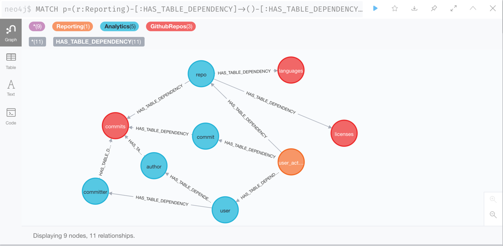

# sqlquerygraph
[](https://github.com/avisionh/sqlqueryraph/actions)
[](https://codecov.io/gh/avisionh/sqlquerygraph)
[](https://www.python.org/downloads/)
[](https://www.codefactor.io/repository/github/avisionh/sqlquerygraph)
[](https://opensource.org/licenses/MIT)
[](https://github.com/psf/black)

Parse your SQL queries and represent their structure as a graph.

Currently, we implement the ability of representing how each of the tables in a set of SQL query scripts depend on each other.

```cypher
MATCH p=(r:Reporting)-[:HAS_TABLE_DEPENDENCY]->()-[:HAS_TABLE_DEPENDENCY]->()
WHERE r.table_name='user_activity'
RETURN p
```


## Requirements
To run the code in here, ensure your system meets the following requirements:
- Unix-like operating system (macOS, Linux, ...) - though it might work on Windows;
- Python 3.8 or above; and
- [Poetry](https://python-poetry.org/docs/) installed.
- [`direnv`](https://direnv.net/) installed, including shell hooks;
- [`.envrc`](https://github.com/avisionh/sqlquerygraph/blob/main/.envrc) allowed/trusted by `direnv` to use the environment variables - see [below](#set-up);

<!--Note there may be some Python IDE-specific requirements around loading environment variables, which are not considered here. -->

### Set-up
For quickstart set-up of the project, run the below in your shell/terminal:
```shell script
# 1. read project-specific environment variables
direnv allow

# 2. activate virtual environment and install package dependencies
poetry shell
poetry install

# 3. check adherence to good standards on every commit
pre-commit install
```

To then extract the tables and their dependencies from the example SQL scripts in the `sql/` directory, run the following in your shell/terminal:
```shell script
python sqlquerygraph.py -sd 'sql' -ed 'neo4j' -rd 'github_repos' 'analytics' 'reporting'
```

### Run neo4j graph database
We use [neo4j](https://neo4j.com/) for this project to visualise the dependencies between tables. To install neo4j locally using Docker Compose, follow the below instructions:
1. Install and open Docker
    + For Mac OSX, install Docker and Docker Compose together [here](https://docs.docker.com/docker-for-mac/install/).
    + For Linux, install Docker [here](https://docs.docker.com/engine/install/) and then follow these [instructions](https://docs.docker.com/compose/install/) to install docker-compose.
    + For Windows, install Docker and Docker Compose together [here](https://docs.docker.com/docker-for-windows/install/).
1. Create a new file, `.secrets`, in the directory where this `README.md` file sits, and store the following in there. This allows you to set the password for your local neo4j instance without exposing it.
   ```
   export NEO4J_AUTH=neo4j/<your_password>
   export NEO4J_AUTH=neo4j
   export NEO4J_AUTH=<your_password>
   ```
1. Update your `.env` file to take in the new `.secrets` file you created by entering the below in your shell/terminal:
   ```shell script
   direnv allow
   ```
1. Download the neo4j image. Within this directory that has the `docker-compose.yml` file, run the below in your shell/terminal:
    ```shell script
    docker-compose up
    ```
1. If it's the first time you have downloaded the neo4j docker image, wait awhile (maybe an hour, depends on your machine specs). If you have downloaded the neo4j docker image before (such as going through these instructions), then wait a few minutes. You will know when it's ready when you get the following message in your terminal:
   ```
   ...
   neo4j    | 2021-05-26 06:40:15.270+0000 INFO  Bolt enabled on 0.0.0.0:7687.
   neo4j    | 2021-05-26 06:40:16.412+0000 INFO  Remote interface available at http://localhost:7474/
   neo4j    | 2021-05-26 06:40:16.414+0000 INFO  Started.
   ```
   Then launch neo4j locally via opening your web browser and entering the following web address:
    - http://localhost:7474/
1. The username and password will be:
   ```
   username: neo4j
   password: <your_password>
   ```
1. Load the data into the database through entering the following in a separate terminal:
   ```
   docker exec -it neo4j bash
   # move .csv files into neo4j's import/ directory
   mv data/*csv import/
   ```
1. In your local terminal:
   ```shell script
   python -m loader.py --file 'neo4j/<name_of_cypher_file'
   ```
1. When you have finished playing with your local neo4j instance, remember to stop it running by executing the below in your shell/terminal:
   ```shell script
   # see name of container running, which most likely is called 'neo4j'
   docker ps
   # stop container running
   docker stop <name_of_container>
   ```

***

## Acknowledgements
This builds on the excellent [moz-sql-parser](https://github.com/mozilla/moz-sql-parser) package.

With thanks also to the [Google Cloud Public Dataset Program](https://cloud.google.com/solutions/datasets) for which the SQL queries in this repo are based off the program's [GitHub repos](https://console.cloud.google.com/marketplace/product/github/github-repos) dataset.
